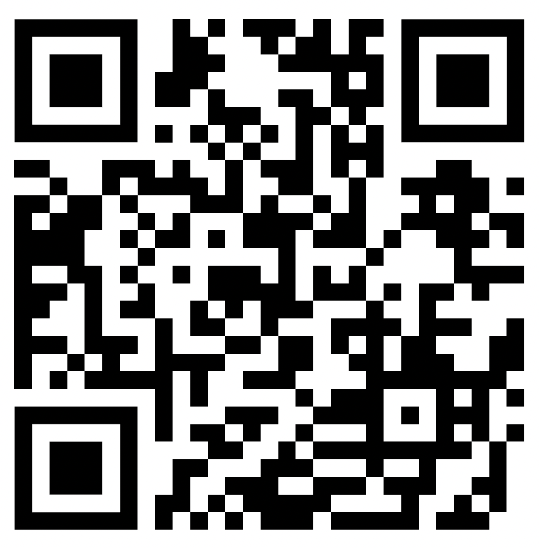
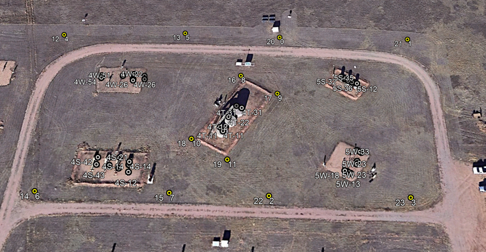
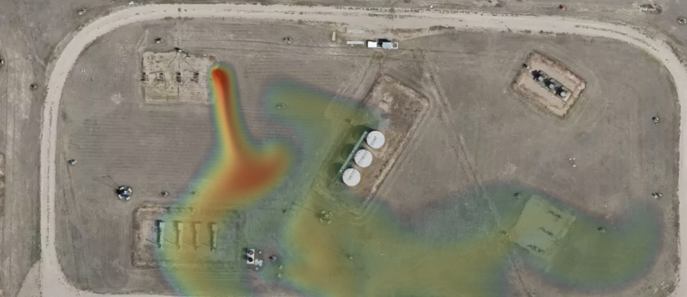

# EOG Resources - HackUTD X: Golden Hour
# Leak Detection Challenge

## Problem Statement

Continuous monitoring at oil and gas production facilities enables the detection of unintended methane leaks from equipment, and a swift response to minimize the impact. These operations are supported by sophisticated sensor networks and data analysis.

Here, your hackathon journey takes you to a single production facility that is equipped with stationary methane and weather sensors. Develop a solution that utilizes the trends in the sensor data, and wind direction and speed to identify if there is a leak and if so the locations of the methane leaks that occurred during a 24-hour timeframe. The locations of the leak points are in the image below and are labeled 4W,4S,5T,5W,5S.

Work together to build a user interface (e.g., web app, mobile app, dashboard) that provides an intuitive and informative way for facility operators to understand the severity and extent of the detected leaks.

A prize will be awarded to the 2 best teams for this category, please come and see the EOG Resources team for more details.

Access the project github with this QR code: 




## Resources

Use this repo to pull the available data for your project. You are given leak events from a 24 hour window to help build your detection algorithm. All provided documents are csv files and any date/time data is in UTC.

The specific facility you will be working with is shown here:



[Here is a link](https://www.google.com/maps/place/40%C2%B035%2746.0%22N+105%C2%B008%2724.3%22W/@40.5955073,-105.1399915,163m/data=!3m1!1e3!4m4!3m3!8m2!3d40.596114!4d-105.140075?entry=ttu) to the facility in Google Maps

Here is an example of a leak:



## Files

```sensor_readings.csv```

This file gives the methane concentration readings for the 24 sensors at the facility. The unit of the concentration values is not important. Work with your team to determine thresholds for alarming concentration levels. Please note the sensors are effected by temperature and humidity. You might want to consider anomaly detection as an approach. Every sensor has a unique key that gives a latitude and longitude within the key.

---

```leak_locations_and_rate.csv```

This file gives the latitude and longitude coordinates of known leak points or leak sources. A leak point for instance could be an oil storage tank or a pipe connection between equipment. To help build your model you are also given known leak rates of the leak points at the facility. This data was captured for model calibration purposes and will be unknown for any other days at this facility, and other facilities.

**Note**, you can use this file to help build a detection model. When your model is applied to a new facility, however, these leak points are not known.

Units:
- `LeakRate` - kg/h

---

```weather_data.csv```

This file provides weather data such as pressure, temperature, wind speed etc. at the facility during the 24 hour timeframe.

Units:
- Barometric Pressure - millibars (mb)
- Temperature - Celsius

## Additional Information on Deliverables

After submission of your project it will be tested for a different day of recorded sensor readings. Please set up your project so that it can ingest a new `sensor_readings.csv` file with the same format as the one provided to you here.

Please create an output file in the following format with the detected leaks. Location can have one or more leak locations. If there is more than one please use `|` to separate them:

time, location
1699028053, 4W|4T
1699028153, 5S  

If you can't determine the location put None in the location column:

1699028053, None
1699028153, None

Name your file with your team name with no spaces or special character.


The Scoring will be as follows:
- 40% detection - We want you to identify true positives and true negatives while not getting false negatives and false positives. Please refer to the [Confusion Matrix](https://en.wikipedia.org/wiki/Confusion_matrix) for more info. 
- 40% identifying the location of the leak
- 20% UI

For the interface for a live leak detection diagram you should use a map API, such as the one [provided by Google](https://developers.google.com/maps/apis-by-platform).

## References 

[Isolation forest](https://en.wikipedia.org/wiki/Isolation_forest)

[Anomoly Detection](https://pyod.readthedocs.io/)

[Methane](https://en.wikipedia.org/wiki/Methane)

## Bonus

Teams can earn bonus points by visualizing moving leak plumes across the facility.

[Here is an equation](https://courses.ecampus.oregonstate.edu/ne581/eleven/plume.htm) for the gaussian plume, use this to determine the plume generated by the leak and draw it on the map.

## Prizes

The team with the best project will win 4 OLED Nintendo Switches

The second best team will win 4 mechanical keyboards

---

We look forward to your demonstration! Good luck :)
